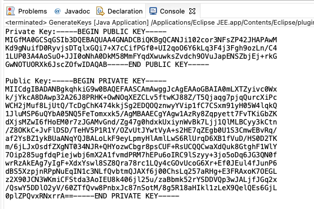
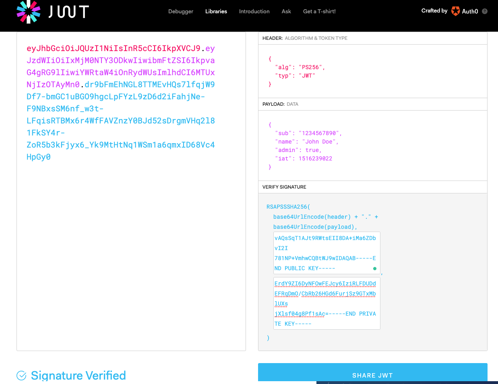

# AsymetryCryptographyTest
Generates private key for JWT signature creation and public key for signature verification

This classes shows how asymetry encryption is done in java. The GenerateKeys.java file generates a key pair and prints it out at the console
like :-

 

Now if you cut and paste the public and private key into the [JWT.io screen](https://jwt.io/), it will be a good key pair to both sign and also verify the jwt signature, like the following:-

 

